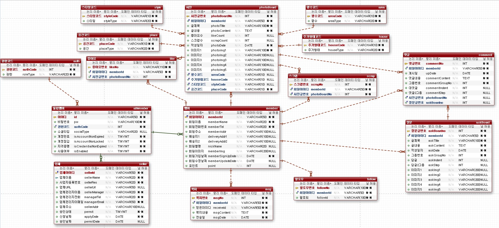
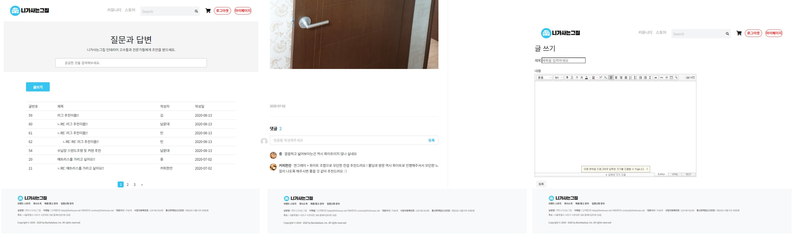
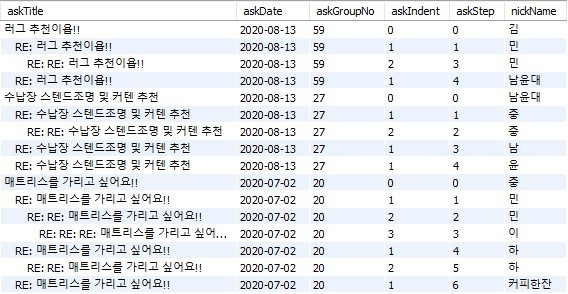
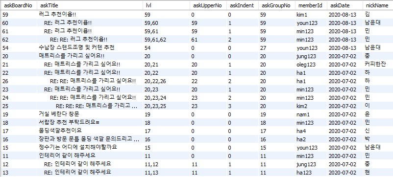
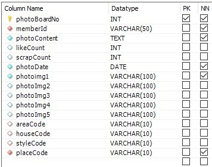
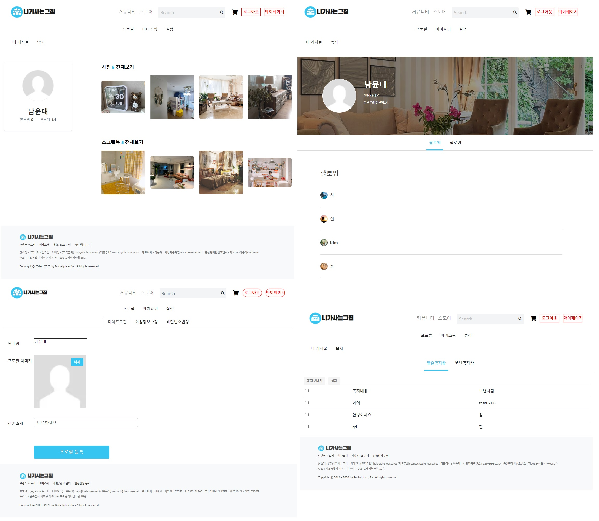

# The house(니가사는그집) 팀 프로젝트

<br />

## 목적
* 오늘의 집을 벤치마킹 하기로 한 만큼 최대한의 기능 구현.
* 다양한 API 또는 구현 방식 시도.

<br />

## 사용 기술
* Spring Boot 2.3.0
* Spring Security
* MySQL
* MyBatis
* Gradle
* BootStrap
* JQuery(Ajax)
* Naver Smart Editor API
* Thymeleaf

<br />

## 담당 파트
* 질문 게시판
  * 글 등록, 수정 및 삭제
  * 페이징
  * 댓글
* 사진 게시판
  * 글 등록, 수정 및 삭제
  * 댓글
  * 스크랩
  * 좋아요
* 사용자
  * 프로필 수정
  * 팔로우, 팔로잉
  * 쪽지
  * 스크랩 목록
* 관리자
  * 업체 관리

<br />

## 담당 파트 ERD

<br />



<br />

## 기능

<br />

### 목차
* 질문 게시판(계층형 쿼리 개선)
* 사진 게시판(게시글 수정 문제 해결)
* 마이페이지

<br />

## 질문 게시판(계층형 쿼리 개선)

<br />



질문 게시판은 인테리어나 소품에 대한 질문을 주로 하는 게시판입니다.   
답글을 작성할 수 있어야 한다고 생각했기에 계층형 구조로 처리하게 되었고 작성 기능에 Naver Smart Editor API를 사용해 처리했습니다.   
텍스트와 이미지 모두 업로드가 가능한 게시판이며 상세 페이지에서는 댓글 작성이 가능합니다.   

<br />




상단 이미지는 수정하기 전 프로젝트 마무리 당시 테이블 구조입니다.   
최상위 계층의 boardNo를 GroupNo로 갖게 되며 Indent로 계층을 표현한 뒤 Step으로 순서를 처리하는 방법입니다.   
이 방법을 사용하게 되면 중간에 위치해야 하는 답글이 작성되었을 때 그 하위에 위치하는 모든 데이터의 step을 수정해야 한다는 단점이 있었습니다.   
이 문제를 해결하고자 찾은 방법은 두가지가 있었습니다.

첫번째, 소수점으로 표현.   
첫 답글은 0.1, 두번째 답글은 0.2, 첫 답글의 답글은 0.11 같은 형태로 표현하는 방법입니다.   
이 방법으로 처리하게 되면 Step 값을 정렬할 필요도 없고 좀 더 수월하게 처리할 수 있다는 장점이 있었습니다.   
하지만 소수점 표현인 만큼 답글 개수에 제한을 두지 않으면 문제가 발생할 수 있다는 단점이 있어 명확한 해결 방법이 되지 못했습니다.

두번째, UpperNo의 사용.   
Step 컬럼을 제거하고 UpperNo에 자신의 한 단계 위 게시글의 boardNo를 담도록 하는 방법입니다.   
두번째 이미지가 UpperNo를 사용한 방법으로 수정한 테이블의 구조입니다.   
lvl의 경우 테이블에 실제 존재하는 컬럼은 아니고 쿼리로 인해 생성되는 컬럼입니다.

<br />

```sql
<select id="askBoardList" resultTYpe="com.bit.house.domain.AskBoardVO">
    WITH RECURSIVE board_CTE AS(
        SELECT askBoardno
            , memberId
            , askTitle
            , askUpperNo
            , askIndent
            , CAST(askBoardno AS CHAR(100)) lvl
            , askGroupNo
            , askDate
        FROM askboard
        WHERE askUpperNo = 0
        UNION ALL
        SELECT b.askBoardno
            , b.memberId
            , b.askTitle
            , b.askUpperNo
            , b.askIndent
            , CONCAT(c.lvl, ',', b.askBoardno) lvl
            , b.askGroupNo
            , b.askDate
        FROM askboard b
            INNER JOIN board_CTE c
            ON b.askUpperNo = c.askBoardno
      )
      SELECT a.askBoardno
           , CONCAT(REPEAT('      ', a.askIndent), '', a.askTitle) AS askTitle
           , a.lvl
           , a.askUpperNo
           , a.askIndent
           , a.askGroupNo
           , a.memberId
           , a.askDate
           , m.nickName
      FROM board_CTE a
        INNER JOIN member m 
        ON a.memberId = m.memberId
      ORDER BY askGroupNo desc, lvl
      LIMIT #{pageStart}, #{perPageNum}
</select>
```

쿼리는 이렇게 재귀쿼리를 사용했습니다.   
재귀 호출을 통해 lvl 컬럼에 최상위 계층부터 자신까지의 경로를 모두 담을 수 있도록 하는 방법으로 문제를 해결할 수 있었습니다.   
하지만 재귀 쿼리를 사용하면 그만큼의 처리시간도 고려해야 하고, 쿼리도 너무 복잡하게 작성되기 때문에 이것을 개선하기 위하여 이후 프로젝트에서는 lvl 컬럼에서 힌트를 얻어 UpperNo의 구조를 lvl과 같은 구조로 설계하는 방법으로 사용하고 있습니다.   

<br />

## 사진 게시판(게시글 수정 문제 해결)

사진 게시판의 경우 프로젝트 마무리까지 수정 기능의 문제를 해결하지 못한 채 프로젝트를 종료하게 되었습니다.   
그래서 종강 이후 다른 프로젝트를 통해 문제를 해결하게 되었습니다.   
문제는 테이블을 분리하는 것만으로 간단하게 해결할 수 있었습니다.



<br />

테이블 구조는 이렇게 하나의 row에 5장의 이미지 파일을 받을 수 있도록 설계했습니다.   
이렇게 설계하다보니 수정이 발생하는 경우 어느 데이터를 삭제할지, 어떻게 데이터들을 당겨올지에 대해 고민해야 했고 이 문제를 해결하지 못했었습니다.   
그래서 이미지 데이터는 다른 테이블로 분리하여 관리하는 것으로 수정 과정에서 고민해야 할 문제를 간단하게 해결할 수 있었습니다.   

하지만 문제가 이렇게 된 만큼 이 설계에서도 문제를 해결해보고자 고민하게 되었고 택한 방법은 모든 이미지 데이터를 수정하는 방법입니다.   

```java
    //이미지 파일 저장 및 VO에 set 해주는 메소드(insert, update 처리)
    public PhotoBoardVO insertPhoto(MultipartHttpServletRequest mtf, HttpServletRequest request, PhotoBoardVO photoBoardVO) throws Exception{
        List<String> allPhoto = new ArrayList<>();

        if(request.getParameterValues("allPhotoName") != null) {
            allPhoto = Arrays.asList(request.getParameterValues("allPhotoName"));
        }

        List<MultipartFile> fileList = mtf.getFiles("files");
        
        int idx = allPhoto.size() - fileList.size();

        String type = "";

        if(allPhoto.size() == 0){
            type = "in"; //insert
        }else{
            type = "up"; //update
        }

        if(fileList.get(0).getSize() != 0){
            String filePath = request.getSession().getServletContext().getRealPath("image/board/photoboard/");

            for(MultipartFile mf : fileList){
              StringBuffer sb = new StringBuffer();
              String originFileName = mf.getOriginalFilename();
              String saveName =  sb.append(new SimpleDateFormat("yyyyMMddHHmmss").format(System.currentTimeMillis()))
                                  .append(UUID.randomUUID().toString())
                                  .append(originFileName.substring(originFileName.lastIndexOf("."))).toString();
              String saveFile = filePath + saveName;
      
              if(type == "in"){
                allPhoto.add("/board/photoboard/" + saveName);
              }else if(type == "up"){
                allPhoto.set(idx, "/board/photoboard/" + saveName);
              }
              
              mf.transferTo(new File(saveFile));
              idx++;
            }
        }

        //이미지 파일 개수에 맞게 set
        int filesSize= allPhoto.size();
        if( filesSize != 0){
          int i = 1;
          switch (filesSize ){
            case 5 :
                photoBoardVO.setPhotoImg5(allPhoto.get(filesSize - i));
                i++;
            case 4 :
                photoBoardVO.setPhotoImg4(allPhoto.get(filesSize - i));
                i++;
            case 3 :
                photoBoardVO.setPhotoImg3(allPhoto.get(filesSize - i));
                i++;
            case 2 :
                photoBoardVO.setPhotoImg2(allPhoto.get(filesSize - i));
                i++;
            case 1 :
                photoBoardVO.setPhotoImg1(allPhoto.get(filesSize - i));
          }
        }

        if(type == "up"){ //update 때 비어있어야 하는 컬럼 null로 설정
          if(filesSize < 5){
            switch(5 - filesSize){
              case 4 :
                photoBoardVO.setPhotoImg2(null);
              case 3 :
                photoBoardVO.setPhotoImg3(null);
              case 2 :
                photoBoardVO.setPhotoImg4(null);
              case 1 :
                photoBoardVO.setPhotoImg5(null);
            }
          }
        }

        return photoBoardVO;
    }
```

FrontEnd에서는 삭제되지 않은 기존 이미지 파일명을 서버에 같이 전달하게 됩니다.   
그럼 서비스단에서는 insert, update 메소드에서 파일 저장 메소드인 위 메소드를 호출하게 되는데 이때 insert인지 update인지에 따라 차이가 발생하기 때문에 in 또는 up으로 타입을 같이 전달하도록 했습니다.   
allPhoto라는 리스트에 삭제되지 않은 기존 파일명들을 담아주고, 이후 새로 추가되는 파일들을 리스트에 추가적으로 담도록 처리했습니다.   
그 후 VO에 개수에 맞게 앞쪽 필드부터 데이터를 담도록 처리했으며, 끝쪽 필드는 null로 비어있도록 하기 위해 수정 처리인 경우에만 null을 담을 수 있도록 처리했습니다.   

이렇게 처리하게 되면서 문제를 해결할 수는 있었지만 테이블을 분리했을 때 보다는 처리과정이 많고 복잡해지기 때문에 비효율적이라는 생각을 하고 있습니다.   
현재는 테이블 분리로 인해 각 이미지 데이터에 대해 Step값을 부여해 순서를 정렬할 수 있도록 하기 때문에 가장 큰 Step 값 만을 조회 해 데이터를 저장하도록 하고 있습니다.   
분리하는 방법에 비해 이 방법으로 처리하게 되면 클라이언트 단에서도 삭제해야할 파일 외에도 기존 파일들을 모두 관리해야 하고, 서버에서도 다 정렬한 뒤 각 필드에 하나하나 담아주는 과정, 이후 비어있어야 하는 필드에 대한 null 처리까지 수행해야 하는 처리가 많이 늘어나는 것을 확인 할 수 있었습니다.   

그래도 이 문제를 해결하게 되면서 설계에 대한 중요성도 깨달을 수 있었지만, 조금은 비 효율적인 설계이더라도 코드를 어떻게 작성해서 해결해야 할지에 대해 고민을 할 수 있었던 좋은 경험이었다고 생각합니다.

<br />

## 마이페이지



마이페이지에는 프로필, 마이쇼핑, 설정 기능이 존재합니다.   
여기서 저는 프로필 기능들을 담당해 구현했습니다.   
프로필 카테고리에서는 자신이 작성한 사진 게시글의 리스트를 볼 수 있으며, 스크랩한 게시글도 확인할 수 있습니다.   
페이지에 팔로우 기능이 존재하기 때문에 팔로우, 팔로잉 목록을 확인할 수 있으며 상대방 프로필을 클릭하게 되면 자신의 프로필 페이지처럼 그 사람이 작성한 사진 또는 스크랩 한 게시글들을 볼 수 있습니다.   
회원가입 시 닉네임은 필수사항으로 받지 않고 닉네임이 비어있는 경우에는 아이디가 출력되도록 기획하고 설계했기 때문에 마이프로필에서 닉네임 설정과 프로필 이미지, 한줄 소개를 작성할 수 있습니다.   
쪽지 탭에서는 상대방에게 쪽지를 보낼 수 있으며, 보낸 쪽지와 받은 쪽지를 확인할 수 있도록 구현했습니다.


<br />

## 느낀점과 고민중인 부분
이 프로젝트를 진행하면서 설계에 대한 중요성을 느낄 수 있었습니다.   
이미지 게시판의 수정 문제를 해결하면서 설계가 잘못되는 경우 서버에서 처리해야 할 코드의 양도 늘어나고 그게 성능 저하로 이어 질 수 있다고 느꼈습니다.   
수정 처리의 경우 테이블 분리를 통한 문제 해결의 경우 현재 프로젝트 구조보다 간단하게 파일 데이터의 삭제와 추가가 이루어지지만 현재 구조를 유지한다면 FrontEnd에서도 이미 저장되어 있는 데이터를 담고 있다가 같이 보내줘야 하고 하나의 row에 모든 것을 담는 만큼 데이터베이스 요청이 줄어드는 대신 조건문을 통한 처리가 길어지게 되는 것을 확인할 수 있었습니다.   
이번 문제해결을 통해 이러한 경우 어떻게 코드를 작성해야 할지에 대한 좋은 경험을 쌓을 수 있었지만 그만큼 테이블 설계가 중요하다는 것을 크게 느낄 수 있었습니다.

<br />
<br />

---


# thehouseUpdate
프로젝트 수정   
thehouse Project 수정본.

## 수정 전 문제점

1.  로그인 하지 않으면 사진게시판과 질문 게시판 글을 볼 수 없는 에러.  O
2.  사진게시판 무한스크롤 끝나지않고 계속 중복되서 출력 되는 에러. O
3.  질문게시판 검색 후에 페이징처리 안되는 에러. O
4.  무조건 아이디가 출력되고 닉네임은 출력 안되는 상태. O
5.  사진게시판 이미지 수정 불가.  O
6.  프로필 수정시에 이미지 선택 안하면 에러 발생. O
7.  프로필 이미지 선택하면 버튼 사이즈보다 더 크게 나와서 아래까지 침범하는 문제.  O
8.  프로필 이미지 버튼 사이즈가 왼쪽까지 넓게 설정된 문제. O
9.  프로필 이미지 수정은 가능하나 삭제는 안되는 문제.  O
  

## 수정현황

### 7/14

* 질문게시판 제목클릭해서 이동하는걸로 변경하고 로그인하지 않은 상태에서는 글 상세 볼 수 없고 로그인으로 이동하도록 변경.

### 8/5

* 아이디만 표시되던것 닉네임 등록 해두면 닉네임으로. 닉네임이 없으면 아이디로 출력되도록 변경.
* 프로필 설정에서 이미지 선택하면 preview사이즈보다 크게 출력되던거 사이즈 조절.
* 프로필 이미지 버튼 범위 왼쪽으로 넓게 되있던거 이미지 사이즈에 맞춰서 변경.


### 8/10

* 로그인 안한상태에서 글 볼 수 없는것 수정
* view를 새로 만들어서 작성.
* 시큐리티나 비즈니스 로직으로 처리할 수 있는 방법 있을 것 같긴한데 아직  못함..


### 8/11

* 프로필 이미지 삭제 버튼 생성 및 구현.


### 8/12

* 질문게시판 검색 후 페이징 처리 해결.   
* 비회원 게시판 글쓰기 버튼 누르면 로그인화면으로 이동하도록 수정.
* 비회원 질문게시판 상세페이지에서 답글달기 버튼 다시 활성화하고 누르면 로그인화면으로 이동하도록 수정.

### 11/26

* 프로필 이미지 변경하지 않을 시 수정 불가 에러 해결.
* MultipartHttpServletRequest 사이즈 체크 하는 방법으로 해결.
* 좀 더 상세한 해결 방법은 MyPageServiceImpl 내 해당 메서드에 주석으로 작성.

### 12/06
* PhotoBoardUpdate 수정.
* DB 설계는 변경하지 않는 상태에서 코드만 수정해 구현하는것을 목표로 진행.
* PhotoBoardServiceImpl에 주석으로 설명 작성.
* form으로 데이터 전송하는 방법 그대로 유지.
* 삭제 이미지명은 input으로 생성해 넘겨주서 삭제처리할 수 있도록 구현하고 기존 이미지와 새로 등록한 이미지들도 input으로 생성해 넘겨줘서 처리.
* 새로 등록한 이미지 파일 저장 및 DB에 넣어주는것은 기존 코드 유지.
* 사진게시판 무한스크롤 수정 완료.
* 무한스크롤에서는 쿼리문에 LIMIT을 통해 데이터를 가져오도록 구현했었는데 시작점없이 LIMIT 12; 형태로만 되어 있었기 때문에 중복되서 출력되었던 문제.
* 쿼리문에서 LIMIT #{idx}, 12 형태로 바꿔줌으로써 idx값을 넘겨 처리해주도록 구현.
* List 페이지의 컨트롤러에서도 같은 쿼리문을 사용하기 때문에 해당 컨트롤러에서는 idx를 0으로 만들어 넘겨주도록 수정하고
* 스크롤이 내려갈때마다 실행될 때 i라는 값을 하나씩 증가시켜 데이터가 추가되는 시점에 i를 컨트롤러로 넘겨 * 12를 해주는 방법으로 수정해서 구현.
* 이 리펙토링을 마지막으로 기존 담당파트 리펙토링은 마무리.

### 22/04/05
* 계층형 쿼리 재귀쿼리로 수정.
* 재귀쿼리로 변경하면서 DB 컬럼 및 insert, replyInsert 기능 수정.
* askBoardList에서 title 출력부분 수정.
* askBoardList와 askSearchList 메소드 합쳐서 처리하고 view도 askBoardList.html 하나만 사용하도록 수정.
* 비로그인 회원 글 접근시에 askBoardDetailNonMem으로 접근하던것 askBoardDetail로 접근하도록 수정.
* 동일하게 photoBoardDetailNonMem도 photoBoardDetail로 접근하도록 수정.

### 22/04/06
* insertPhotoProc 메소드 처리시에 Controller에서 모든 처리 했었고 updatePhotoProc에서는 service에서 처리했었는데   
  insert도 service로 빼면서 이미지 저장 및 vo에 set해주는 부분 분리해 update와 insert 모두 해당 메소드 통해서   
  파일 저장 및 vo에 넣어주는 방법으로 수정.
* 기존 코드들은 모두 주석처리해서 하단에 남겨둠.
* 이미지 게시판 게시글 삭제시 이미지파일 삭제 코드 누락된것 추가.   
  service에서 처리하도록 구현.